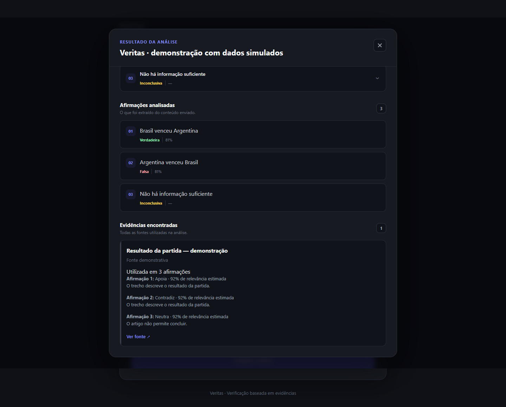
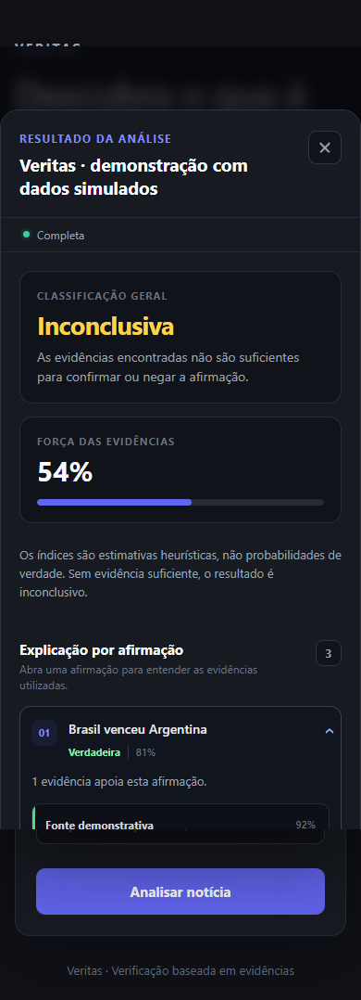

# Veritas

<p align="center">
  <strong>Plataforma full-stack para análise de afirmações e evidências jornalísticas.</strong>
</p>

<p align="center">
  O Veritas decompõe textos em afirmações verificáveis, consulta fontes jornalísticas, avalia evidências e apresenta uma conclusão explicável por afirmação.
</p>

<p align="center">
  <a href="https://veritas-theus.vercel.app">
    <strong>🌐 Acessar aplicação</strong>
  </a>
</p>

---

## Sobre o projeto

O **Veritas** é uma aplicação desenvolvida para auxiliar na análise de informações presentes em notícias, textos e alegações.

Em vez de simplesmente enviar uma notícia para um modelo de IA e perguntar se ela é verdadeira ou falsa, o Veritas divide o problema em etapas independentes:

1. extrai as afirmações do texto;
2. constrói consultas de busca contextualizadas;
3. consulta fontes jornalísticas;
4. organiza e deduplica as evidências encontradas;
5. analisa cada evidência individualmente;
6. classifica as evidências como apoio, contradição ou neutras;
7. calcula consenso e força das evidências;
8. gera um resultado por afirmação;
9. calcula uma classificação geral da análise.

Um princípio importante do projeto é:

> **Ausência de evidência não significa falsidade.**

Quando as fontes encontradas não são suficientes para sustentar uma conclusão, o Veritas retorna **Inconclusiva**.

---

## Aplicação online

**Frontend**

https://veritas-theus.vercel.app

**Backend**

Hospedado no Render.

**Banco de dados**

PostgreSQL hospedado no Neon.

---

## Demonstração



A interface apresenta:

- classificação geral;
- força das evidências;
- resultado individual por afirmação;
- evidências que apoiam;
- evidências que contradizem;
- evidências neutras;
- justificativa da classificação;
- relevância estimada;
- fonte original;
- agrupamento de evidências repetidas.



---

# Funcionalidades

## Análise de afirmações

O Veritas extrai até **10 afirmações** por análise.

Cada afirmação é processada separadamente, mantendo seu texto original durante a classificação.

Exemplo:

```text
Presidente Lula morreu.
Presidente Lula morreu de overdose.
Presidente morreu durante viagem.
```

O sistema consegue identificar contexto compartilhado entre afirmações relacionadas para melhorar as consultas de busca sem modificar a afirmação original armazenada.

---

## Busca contextualizada

As evidências são obtidas através de consultas à API do **GNews**.

O mecanismo de busca:

- remove termos pouco relevantes;
- preserva anos e períodos importantes;
- gera múltiplas consultas por afirmação;
- utiliza contexto herdado quando apropriado;
- deduplica URLs;
- limita a quantidade de resultados analisados.

---

## Classificação de evidências

Cada evidência pode ser classificada como:

| Classificação | Significado |
|---|---|
| `SUPPORTS` | A evidência apoia a afirmação |
| `CONTRADICTS` | A evidência contradiz a afirmação |
| `NEUTRAL` | A evidência não permite concluir |

As evidências direcionais também possuem:

- relevância estimada;
- trecho literal utilizado;
- justificativa;
- fonte;
- URL original.

---

## Vereditos

O Veritas utiliza cinco possíveis classificações:

```text
VERDADEIRA
PROVAVELMENTE_VERDADEIRA
INCONCLUSIVA
PROVAVELMENTE_FALSA
FALSA
```

O resultado não é definido diretamente pelo modelo de IA.

A aplicação combina:

- direção das evidências;
- relevância;
- consenso;
- diversidade de fontes;
- quantidade de fontes independentes;
- força da conclusão.

---

# Arquitetura

```text
┌───────────────────────────────┐
│       React + TypeScript      │
│            Vite              │
└───────────────┬───────────────┘
                │
                │ HTTP / JSON
                ▼
┌───────────────────────────────┐
│            FastAPI            │
└───────────────┬───────────────┘
                │
                ▼
┌───────────────────────────────┐
│       Extração de Claims      │
└───────────────┬───────────────┘
                │
                ▼
┌───────────────────────────────┐
│     Contexto + News Search    │
│            GNews             │
└───────────────┬───────────────┘
                │
                ▼
┌───────────────────────────────┐
│      Ranking de Evidências    │
│   Deduplicação + Relevância   │
└───────────────┬───────────────┘
                │
                ▼
┌───────────────────────────────┐
│       Interpretação por IA    │
│                               │
│ Gemini                        │
│    ↓ fallback                 │
│ Groq                          │
│    ↓ fallback                 │
│ Heurística local              │
└───────────────┬───────────────┘
                │
                ▼
┌───────────────────────────────┐
│    Consenso + Classificação   │
└───────────────┬───────────────┘
                │
                ▼
┌───────────────────────────────┐
│       PostgreSQL / Neon       │
└───────────────────────────────┘
```

Documentação complementar:

- [Arquitetura](docs/architecture.md)
- [QA final](docs/QA-final.md)

---

# Fallback de IA

O Veritas possui uma cadeia de fallback para evitar que a aplicação dependa completamente de um único serviço externo.

```text
Gemini
   ↓
falha operacional / quota
   ↓
Groq
   ↓
falha operacional / resposta inválida
   ↓
Heurística local
```

Entre os erros tratados estão:

- rate limit;
- timeout;
- indisponibilidade;
- falha de conexão;
- resposta inválida;
- falhas temporárias do provedor.

Isso permite que a aplicação continue funcionando mesmo quando um dos provedores está indisponível.

---

# Decisões de engenharia

## Sem evidência ≠ falso

Uma das principais regras do projeto é impedir que falta de informação seja automaticamente interpretada como falsidade.

Sem evidências direcionais suficientes:

```text
Resultado → INCONCLUSIVA
Força → —
```

---

## IA não define o resultado final sozinha

Os modelos são utilizados para interpretar a relação entre a evidência encontrada e a afirmação analisada.

O resultado final continua sendo calculado pelos serviços locais do Veritas.

Isso reduz a dependência de uma resposta única do modelo.

---

## Validação das respostas dos modelos

As respostas da IA passam por validação estruturada.

São verificados:

- índices das afirmações;
- índices das evidências;
- valores permitidos de classificação;
- relevância;
- existência de citações;
- correspondência literal do trecho citado com a evidência original.

Respostas inválidas podem ativar o próximo nível de fallback.

---

## Contexto entre afirmações

Algumas afirmações dependem do contexto das anteriores.

Exemplo:

```text
Presidente Lula morreu.
Presidente Lula morreu de overdose.
Presidente morreu durante viagem.
```

A terceira afirmação pode utilizar **Lula** como contexto de busca quando existe evidência suficiente de que essa é a entidade dominante.

O texto original da afirmação continua intacto.

---

## Deduplicação de evidências

Uma mesma matéria pode ser relevante para várias afirmações.

Em vez de apresentar cartões duplicados, o frontend agrupa a evidência e informa em quais afirmações ela foi utilizada.

Exemplo:

```text
Utilizada em 3 afirmações

Afirmação 1 → Contradiz
Afirmação 2 → Contradiz
Afirmação 3 → Contradiz
```

---

# Stack

## Frontend

- React
- TypeScript
- Vite
- CSS
- Vitest

## Backend

- Python
- FastAPI
- Pydantic
- SQLAlchemy
- Uvicorn

## Banco de dados

- PostgreSQL
- Neon
- SQLite para desenvolvimento local

## IA

- Google Gemini
- Groq
- heurística local

## Busca de notícias

- GNews API

## Infraestrutura

- Vercel
- Render
- Neon

## Qualidade

- Pytest
- pytest-cov
- Vitest
- testes unitários
- testes de integração
- QA desktop
- QA mobile
- rate limiting
- tratamento estruturado de erros

---

# Testes

O projeto possui atualmente:

```text
214 testes de backend
6 testes de frontend
220 testes automatizados no total
```

Cobertura de backend:

```text
81%
```

Cobertura do cliente Groq:

```text
95%
```

Além dos testes automatizados, foram realizados testes manuais envolvendo:

- notícias verdadeiras;
- notícias falsas;
- alegações inventadas;
- ausência de evidências;
- evidências conflitantes;
- contexto entre afirmações;
- até 10 afirmações por análise;
- falha do Gemini;
- fallback para Groq;
- fallback para heurística local;
- responsividade desktop/mobile;
- ambiente de produção.

---

# Executar localmente

## Backend

Entre na pasta:

```bash
cd backend
```

Crie o ambiente virtual:

```bash
python -m venv venv
```

Ative o ambiente.

Windows:

```powershell
.\venv\Scripts\activate
```

Instale as dependências:

```bash
pip install -r requirements.txt
```

Inicialize o banco:

```bash
python -m app.init_db
```

Execute a API:

```bash
uvicorn app.main:app --reload
```

Backend local:

```text
http://localhost:8000
```

Swagger:

```text
http://localhost:8000/docs
```

---

## Frontend

Entre na pasta:

```bash
cd frontend
```

Instale as dependências:

```bash
npm install
```

Execute:

```bash
npm run dev
```

Frontend local:

```text
http://localhost:5173
```

---

# Variáveis de ambiente

O backend utiliza variáveis de ambiente para configuração dos serviços externos.

Exemplos:

```text
APP_ENV
DATABASE_URL
CORS_ORIGINS

GNEWS_API_KEYS

GEMINI_ENABLED
GEMINI_API_KEY
GEMINI_MODEL

GROQ_API_KEY
GROQ_MODEL
```

O frontend utiliza:

```text
VITE_API_BASE_URL
```

> Nunca coloque chaves privadas no frontend ou no repositório.

---

# Produção

A infraestrutura atual utiliza:

```text
Frontend
Vercel
↓
Backend
Render
↓
Database
Neon PostgreSQL
```

A aplicação utiliza CORS explícito entre frontend e backend.

O banco PostgreSQL é inicializado automaticamente durante o startup do serviço de produção.

---

# Como preencher uma análise

Para melhores resultados, prefira afirmações factuais específicas.

### Melhor

```text
O PIB do Brasil caiu 8% no segundo trimestre de 2026.
```

### Evite

```text
O PIB caiu.
```

Quando possível, inclua:

- pessoa ou entidade;
- ação ou fato;
- país ou local;
- data;
- período;
- número;
- percentual;
- contexto relevante.

Análises com menos afirmações e frases mais específicas tendem a gerar buscas mais precisas.

---

# Limitações

O Veritas é um sistema de apoio à análise de informação.

Os resultados dependem de fatores como:

- disponibilidade das fontes;
- cobertura das APIs de notícias;
- qualidade dos títulos e resumos;
- atualidade das matérias;
- ambiguidade das afirmações;
- desempenho dos modelos de IA;
- limites e cotas dos serviços externos.

Os índices apresentados são **estimativas heurísticas**, não probabilidades estatísticas de verdade.

Uma classificação elevada não significa certeza absoluta.

---

# Aviso importante

O Veritas utiliza APIs de consulta de notícias e modelos de inteligência artificial para encontrar e interpretar evidências disponíveis publicamente.

Fontes podem estar:

- incompletas;
- desatualizadas;
- fora de contexto;
- incorretas;
- indisponíveis.

O resultado apresentado pelo Veritas **não deve ser utilizado como única fonte para confirmar uma informação**.

Para decisões importantes, consulte também:

- veículos jornalísticos confiáveis;
- fontes oficiais;
- documentos primários;
- outras fontes independentes.

---

# Status

```text
✅ Frontend publicado
✅ Backend publicado
✅ PostgreSQL em produção
✅ Integração GNews
✅ Gemini
✅ Groq fallback
✅ Heurística local
✅ Testes automatizados
✅ QA desktop/mobile
✅ Deploy em produção
```

---

# Objetivo do projeto

O Veritas foi desenvolvido como projeto de portfólio durante a graduação em **Ciência da Computação**, com foco em explorar problemas reais de engenharia de software, integração de APIs e aplicações baseadas em inteligência artificial.

Entre os principais desafios trabalhados estão:

- arquitetura full-stack;
- APIs externas;
- fallback entre serviços;
- tratamento de falhas;
- persistência;
- validação de respostas de IA;
- análise de evidências;
- desambiguação de contexto;
- deduplicação;
- testes automatizados;
- deploy em produção.

---

## Autor

Desenvolvido por **Matheus Henrique**.

GitHub: [@theus-1](https://github.com/theus-1)

---

<p align="center">
  <strong>Veritas — evidências antes de conclusões.</strong>
</p>
